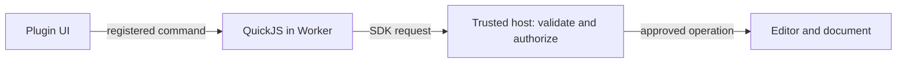

# Plugin architecture

A plugin has **logic**, **UI** and a **manifest**. PCBJam runs the two code parts
separately and controls their access to the editor.

## The four parts

| Part | Job |
|---|---|
| UI iframe | Runs the plugin's HTML, CSS and optional React in its own floating panel. |
| Worker + QuickJS | Runs `main.js` away from the editor's UI thread, with CPU and memory limits. |
| Trusted host | PCBJam's own code. Supplies the SDK connection, validates requests and checks permissions. |
| Editor | Owns the native KiCad/WASM engine and collaborative Yjs document. Executes approved operations. |

PCBJam starts the Worker **directly**, separately from the UI iframe. Inside the
Worker, PCBJam's wrapper creates QuickJS and exposes the limited `pcbjam` API.
Uploaded logic runs inside QuickJS, not as unrestricted Worker JavaScript.

The wrapper is the connection and permission boundary: without it, your isolated
code could calculate things but could not ask PCBJam to read a document or place
a symbol. The trusted host handles those requests through specific adapters.

## One API call

For example, a button calls `pcbjamUI.call('inspect')`. PCBJam forwards that to
the plugin's `inspect` handler in QuickJS. The handler calls `pcbjam.items.list()`;
the trusted host checks the request and reads the current document.
The result returns along the same path to the UI.

Communication uses validated messages and copied data. Plugins never receive
the editor's `Module`, a `Y.Doc`, a WASM pointer or shared editor memory.
Reading a large design therefore has a copying cost; use paged item reads.

## Permissions and isolation

The manifest requests permissions; the user approves them at installation.
Account access is controlled by a database flag, checked on every request.
Opening a plugin creates a temporary server-authorized activation tied to the
signed-in user, session, installed release, project and document. Each host call
checks those grants and current access. Calls waiting on prompts or data loads
are checked again before continuing. Authentication stays in trusted PCBJam code;
plugins need no API key and receive no session credentials.

QuickJS logic has no DOM, Node.js, browser storage or direct network API.
It has a 64 MiB heap and a one-second CPU budget per execution turn.
The iframe has an opaque origin, `sandbox="allow-scripts"` and a restrictive
Content Security Policy. It can manipulate its own DOM and call registered
commands, but cannot access PCBJam's DOM or invoke host APIs directly.
File pickers and placement confirmations live outside plugin HTML.

QuickJS limits apply to logic, not arbitrary iframe JavaScript. Treat data sent
to a plugin's UI as disclosed to that plugin; the sandbox is not a promise of
zero data disclosure or a vulnerability-free browser.

Symbol placement also passes through a separate trusted validation Worker before
reaching the native editor. The normal native commit provides Undo and collaboration.

## Requests to your backend

`pcbjam.http.request()` follows the same host boundary, then reaches PCBJam's
server. The server rechecks the session, installation, project access, user
grants and the exact endpoint policy approved in Postgres. A separate private
transport resolves DNS, rejects private/special addresses and pins the TLS
connection to a validated public IP while verifying the original hostname.
It has no database, R2 or signing credentials. It never follows redirects.

For identity-bearing requests, PCBJam signs a 60-second assertion containing a
plugin-specific user ID, audience, method, URL and body hash. Signing keys stay
on PCBJam's server; the backend gets public keys from the fixed issuer's JWKS
endpoint. The backend verifies the signature and claims and atomically consumes
the request ID in durable storage before handling it. This proves an authorized
request from that PCBJam session, not that a human reviewed each action. The
backend still owns its own authorization and data validation.

Cancellation prevents further work where possible; it cannot undo a request the
backend has already processed. Revocation blocks new requests but does not revoke
an already issued signature before its short expiry. Uninstall/reset in PCBJam
does not delete data saved on the third-party backend.

## Installation and lifecycle

Uploads become immutable, hashed releases in **private R2 storage**. The database
stores ownership, installed versions and approved permissions. Installations
follow the user's account across browsers. This is private installation;
a public marketplace is not available yet.

PCBJam verifies package/runtime integrity before execution. A separate UI service
delivers the iframe through a short-lived, single-use ticket. Matching runtime
assets provide the Worker, QuickJS and SDK.

Closing the panel or switching documents stops the instance and cancels pending
work. Disable, update and uninstall revoke activations; another open tab notices
on its next check, normally within two seconds plus request time.
Previously delivered data cannot be revoked.

Plugin settings use a host-controlled IndexedDB namespace for the account,
project and plugin. They stay in that browser. Disable preserves them; reset
and uninstall revoke the namespace. Selected file handles and UI state disappear
when the instance stops.

[Build a plugin](0008-local-plugin-development.md) ·
[Available APIs](0009-plugin-api-and-permissions.md).
