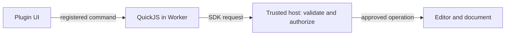

# Plugin architecture

A plugin has **logic**, **UI** and a **manifest**. PCBJam runs the two code parts
separately and controls their access to the editor.

## The four parts

| Part | Job |
|---|---|
| UI iframe | Runs the plugin's HTML, CSS and optional React in its own floating panel. |
| Worker + QuickJS | Runs `main.js` away from the editor's UI thread, with CPU and memory limits. |
| Trusted host | PCBJam's own code. Supplies the SDK connection, validates requests and checks permissions. |
| Editor | Owns the native KiCad/WASM engine and collaborative Yjs document. Executes approved operations. |

PCBJam starts the Worker **directly**, separately from the UI iframe. Inside the
Worker, PCBJam's wrapper creates QuickJS and exposes the limited `pcbjam` API.
Uploaded logic runs inside QuickJS, not as unrestricted Worker JavaScript.

The wrapper is the connection and permission boundary: without it, your isolated
code could calculate things but could not ask PCBJam to read a document or place
a symbol. The trusted host handles those requests through specific adapters.

## One API call

For example, a button calls `pcbjamUI.call('inspect')`. PCBJam forwards that to
the plugin's `inspect` handler in QuickJS. The handler calls `pcbjam.items.list()`;
the trusted host checks the request and reads the current document.
The result returns along the same path to the UI.

Communication uses validated messages and copied data. Plugins never receive
the editor's `Module`, a `Y.Doc`, a WASM pointer or shared editor memory.
Reading a large design therefore has a copying cost, and that copy happens on
the thread that draws the editor.

## Large reads never hold the editor

Copying a whole board in one go blocked the editor for up to a second on a slow
laptop (measured in Chromium, Firefox and WebKit on real boards), and a fixed
chunk size did not help: one filled zone can be several megabytes by itself.
`documents.export()` and `board.geometry()` are therefore **time-sliced**. The
editor works for about 8 ms, hands over at most 256 KiB of text, rests for as
long as it worked, and continues; it can stop in the middle of a single item.
Data crosses as newline-delimited JSON text because a string passes to the
Worker almost for free, while a tree of objects is copied node by node.
A read is pinned to one document revision and stops with `Document changed…`
if the design moves on, so a plugin never sees a mix of old and new. One such
read runs at a time per plugin, up to 32 MiB.
PCBJam's own benchmark re-measures this on every change and fails if any slice
holds the thread longer than 50 ms; the worst recorded slice was 13.4 ms with
the CPU slowed six times.

## Permissions and isolation

The manifest requests permissions; the user approves them at installation.
Account access is controlled by a database flag, checked on every request.
Opening a plugin creates a temporary server-authorized activation tied to the
signed-in user, session, installed release, project and document. Each host call
checks those grants and current access, before the work and again before the
result is delivered, so a call that waited on a prompt cannot complete after
access ended. Plain reads of the document that is already open in the tab may
reuse a server check made within the last two seconds (the same interval at
which every running plugin is re-checked anyway); anything with an effect
outside the plugin — files, placement, selection, backend requests, storage
writes — is checked on every call. Authentication stays in trusted PCBJam code;
plugins need no API key and receive no session credentials.

QuickJS logic has no DOM, Node.js, browser storage or direct network API.
It has a 64 MiB heap and a one-second CPU budget per execution turn. Its timers
exist only while a command is being handled and are cancelled when it settles.
At most four host calls may be in flight; calls beyond 40 in ten seconds are
delayed by the host rather than refused, so a plain read loop needs no pacing.
The iframe has an opaque origin, `sandbox="allow-scripts"` and a restrictive
Content Security Policy. It can manipulate its own DOM and call registered
commands, but cannot access PCBJam's DOM or invoke host APIs directly.
File pickers and placement confirmations live outside plugin HTML.

The host also owns the draggable, resizable window. Optional manifest `uiSize`
dimensions are validated at upload and fitted to the viewport; they are a starting
preference, not permission to change the host DOM. Resizing keeps the iframe and
Worker running and leaves their sandbox and permissions unchanged.

QuickJS limits apply to logic, not arbitrary iframe JavaScript. Treat data sent
to a plugin's UI as disclosed to that plugin; the sandbox is not a promise of
zero data disclosure or a vulnerability-free browser.

Symbol placement also passes through a separate trusted validation Worker before
reaching the native editor. The normal native commit provides Undo and collaboration.

## Files a plugin can save

Every file goes through a confirmation PCBJam draws, and PCBJam performs the
download. The UI iframe has **no download permission**, by design: a download
from `https://elsewhere.example/?data=…` is a network request that does not
navigate the frame, so nothing would show it and the navigation watchdog would
not see it — a silent way out for design data.

Text, JSON, CSV and KiCad files are inert. An HTML page is not: it is plugin
code, with design data inside it, that runs outside PCBJam when the user opens
the file. `files.saveHtml()` therefore has its own permission, the confirmation
says the file contains code, and PCBJam — not the plugin — writes the first
bytes of the page: a Content-Security-Policy that allows inline script, inline
style and embedded images, fonts and media, and nothing over the network. A
policy the page declares itself can only tighten ours, because browsers enforce
all policies at once. PCBJam's tests open hostile saved pages as real local
files in three browser engines and assert that their own code runs and that
no request leaves (fetch, XHR, beacon, WebSocket, form post, image, script,
stylesheet, frame). What it cannot stop is the page sending the user to another
address, for instance from a link they click. Files are only ever downloaded,
never opened by PCBJam: a plugin's page must not run on PCBJam's origin.
`files.saveImage()` accepts PNG only and checks the bytes; SVG can carry script
and is not accepted.

## Changing the selection

`editor.select()` replaces the user's selection. In a shared session a selection
is also a claim on the item, and when two people hold the same item the winner
is decided by user ID, not by who was first — acceptable between people, who
rarely grab the same part in the same second, but a plugin selects in bulk
without looking and could pull a part out of a collaborator's hands mid-move.
The engine therefore never takes an item another client holds: it is reported
as `held`. Only the item ID is reported; who holds it is other users' presence,
which no plugin permission covers. The call is refused while the user has a tool
running or a file is loading, and a refused call changes nothing.

## Board shapes

`board.geometry()` returns shapes the engine computed. It is a read-only walk of
the live board that returns early while a file is loading, as every engine read
that walks the model must.
Nothing a plugin writes reaches the C++ side: the request is two flags, and the
resume cursor is produced by the engine and range-checked when it comes back. It
carries the board's change counter, so a board edited between two slices is
refused rather than resumed with shifted positions. It exposes the same board
`documents:read` already covers, so it needs no further permission.

Both engine-backed calls are feature-detected: on an editor build that predates
them they are simply absent from `context.get().methods`.

## Requests to your backend

`pcbjam.http.request()` follows the same host boundary, then reaches PCBJam's
server. The server rechecks the session, installation, project access, user
grants and the exact endpoint policy approved in Postgres. A separate private
transport resolves DNS, rejects private/special addresses and pins the TLS
connection to a validated public IP while verifying the original hostname.
It has no database, R2 or signing credentials. It never follows redirects.

For identity-bearing requests, PCBJam signs a 60-second assertion containing a
plugin-specific user ID, audience, method, URL and body hash. Signing keys stay
on PCBJam's server; the backend gets public keys from the fixed issuer's JWKS
endpoint. The backend verifies the signature and claims and atomically consumes
the request ID in durable storage before handling it. This proves an authorized
request from that PCBJam session, not that a human reviewed each action. The
backend still owns its own authorization and data validation.

Cancellation prevents further work where possible; it cannot undo a request the
backend has already processed. Revocation blocks new requests but does not revoke
an already issued signature before its short expiry. Uninstall/reset in PCBJam
does not delete data saved on the third-party backend.

## Installation and lifecycle

Uploads become immutable, hashed releases in **private R2 storage**. The database
stores ownership, installed versions and approved permissions. Installations
follow the user's account across browsers. A release is either a private
upload (usable only by the account with developer access that uploaded it) or
published by PCBJam in the marketplace (installable by any signed-in account,
each with its own permission review). PCBJam can unlist a marketplace plugin
(existing installs keep working) or revoke a release (it stops for everyone).

PCBJam verifies package/runtime integrity before execution. A separate UI service
delivers the iframe through a short-lived, single-use ticket. Matching runtime
assets provide the Worker, QuickJS and SDK.

Closing the panel or switching documents stops the instance and cancels pending
work. Disable, update and uninstall revoke activations; another open tab notices
on its next check, normally within two seconds plus request time.
Previously delivered data cannot be revoked.

Plugin settings use a host-controlled IndexedDB namespace for the account,
project and plugin. They stay in that browser. Disable preserves them; reset
and uninstall revoke the namespace. Selected file handles and UI state disappear
when the instance stops.

[Build a plugin](0008-local-plugin-development.md) ·
[Available APIs](0009-plugin-api-and-permissions.md).
